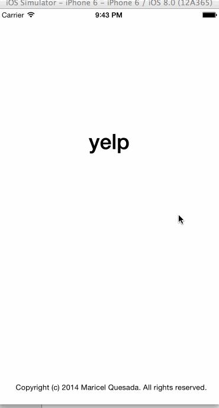

Yelp Client
===========

iOS Swift application to display a list of Restaurants from Yelp using [Yelp Search API](http://www.yelp.com/developers/documentation/v2/search_api).

Time Spent: 15 hours

#Project Requirements

* [x] Search results page
    * [x] Table rows should be dynamic height according to the content height
    * [x] Custom cells should have the proper Auto Layout constraints
    * [x] Search bar should be in the navigation bar (doesn't have to expand to show location like the real Yelp app does).
    * Optional: infinite scroll for restaurant results
    * Optional: Implement map view of restaurant results
* [x] Filter page. Unfortunately, not all the filters are supported in the Yelp API. The filters you should actually have are: category, sort (best match, distance, highest rated), radius (meters), deals (on/off).
    * [x] The filters table should be organized into sections as in the mock.
    * [x] You can use the default UISwitch for on/off states. Optional: implement a custom switch
    * [x] Radius filter should expand as in the real Yelp app
    * Categories should show a subset of the full list with a "See All" row to expand. Category list is here: http://www.yelp.com/developers/documentation/category_list (Links to an external site.)
    * [x] Clicking on the "Search" button should dismiss the filters page and trigger the search w/ the new filter settings.
* Optional: Implement the restaurant detail page.

#Demo

                    
GIF created with [LiceCap](http://www.cockos.com/licecap/).

Icons used in the app from [http://www.freepik.com/](http://www.freepik.com/)

#Libraries Used

* [AFNetworking](https://github.com/AFNetworking/AFNetworking)
* [MBProgressHUD] (https://github.com/jdg/MBProgressHUD)
* [TSMessage] (https://github.com/toursprung/TSMessages)
* [BDBOAuth1Manager] (https://github.com/bdbergeron/BDBOAuth1Manager)

#Issues

* Distance in the cell is hard-coded, not calculated.

